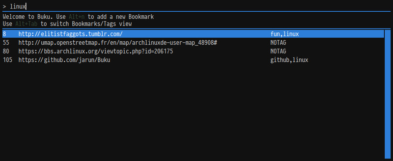

# buku_run
rofi frontend for buku bookmarks manager

## Screenshot

## Features
* Adding bookmarks with tags
* Editing URLs and tags inline
* Deleting bookmarks
* Open URLs

## Dependencies
* gawk
* sed
* [buku](https://github.com/jarun/buku)
* rofi (https://github.com/DaveDavenport/rofi)
* bash
